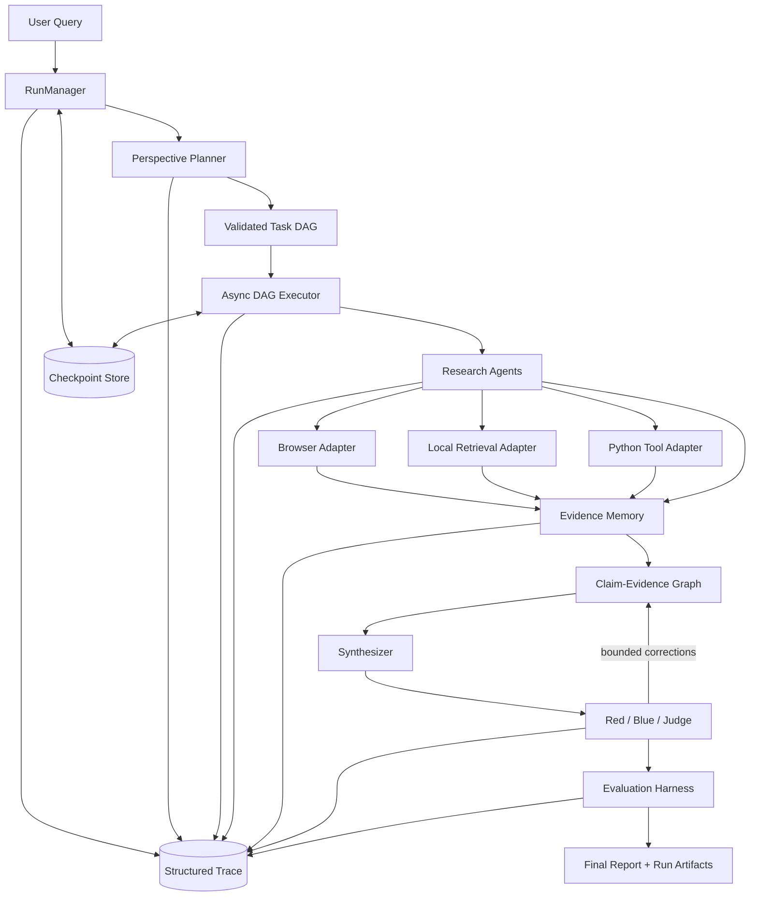

# ResearchOS Agent Architecture

**Status:** Phase 0 logical architecture. Components described below are design
targets unless explicitly marked as implemented.

## System context

ResearchOS Agent separates durable orchestration, research capabilities,
evidence/claim state, verification, and measurement. Domain code depends on
interfaces; integrations depend inward on those interfaces.



The browser, external search, vector store, LLM provider, and trace exporter are
replaceable adapters. They are not part of the domain kernel.

## Component responsibilities

### 1. RunManager

`RunManager` owns the lifecycle boundary for a research run:

- create a run ID and immutable input/configuration snapshot;
- validate operating mode and enabled adapter configuration;
- enforce legal run-status transitions;
- coordinate checkpoint loading, atomic persistence, resume, and finalization;
- expose cancellation and terminal failure semantics;
- maintain aggregate budget state;
- emit a trace event for every lifecycle change.

It does not plan research, execute tools, or judge evidence. Storage is accessed
through a `RunStore` interface. A future filesystem adapter supplies local
durability; tests use an in-memory adapter with equivalent semantics.

Conceptual run states are `CREATED`, `PLANNING`, `READY`, `RUNNING`,
`VERIFYING`, `EVALUATING`, and terminal `COMPLETED`, `PARTIAL`, `FAILED`, or
`CANCELLED`. Phase 1 will formalize the transition table in code and ADR.

### 2. Planner

`PerspectivePlanner` converts a normalized research request into perspectives
and task specifications. A separate DAG builder/validator turns these into a
graph. Validation includes unique task IDs, known dependencies, acyclicity,
capability policy, explicit outputs, and estimated budget constraints.

The planner consumes a model-provider interface rather than a vendor SDK. Its
raw response, parsed result, validation errors, and replan reason are traceable.
Replanning is a bounded runtime command, not an unrestricted recursive call.

### 3. DAG Runtime

`AsyncDAGExecutor` owns the implemented Phase 3 scheduling mechanics:

- calculate ready nodes from committed dependency outcomes;
- run tasks within concurrency and resource limits;
- apply per-task retry, backoff, timeout, and idempotency policies;
- isolate independent branch failures and propagate blocked dependencies;
- checkpoint only validated transitions and committed outcomes;
- resume from persisted state without repeating completed side effects;
- request a bounded replan when policy permits;
- reserve and consume budgets atomically;
- emit scheduling, attempt, checkpoint, budget, and failure events.

The runtime does not know provider details. It dispatches a typed
`TaskExecutionRequest` through a narrow `TaskExecutionBackend`; Phase 3 provides
only an exact-fixture offline mock, not an Agent, Tool, capability registry, or
real provider.

Ready work is ordered by descending task priority, validated topological index,
then task ID. One async coordinator is the only checkpoint writer. It reserves
budget and commits a `RUNNING` attempt before dispatch, and commits an outcome
before unlocking dependents. `ALL_SUCCESS_REQUIRED` is the sole dependency
policy: failed branches propagate stable root blockers while independent
branches continue. `ExecutorStatus.COMPLETED` means every task is terminal and
there is no runnable work; it does not mean every task succeeded. Mapping this
summary to run `COMPLETED`, `PARTIAL`, or `FAILED` remains an external lifecycle
integration responsibility.

The runtime checkpoint at `outputs/<run_id>/checkpoint.json` contains the full
validated DAG and hash, execution policy and hash, run revision, task/attempt
states, committed outcomes, budget ledger, durable replan accounting, and the
last mutation's trace outbox. Filesystem snapshots use same-directory temp
write, file fsync, atomic replace, and parent-directory fsync where supported.
Checkpoint persistence defensively rejects unsafe data; it never redacts or
changes the DAG/checkpoint because doing so would invalidate task semantics and
hashes.

For checkpoint revision `N`, the minimal protocol is trace intent fsync,
atomic snapshot, exact semantic event replay from the embedded outbox, then
trace committed fsync. The outbox stores each complete immutable `TraceEvent`
descriptor, including its original timestamp, identity, sanitized attributes,
and canonical hash. If a crash leaves the snapshot without settlement, resume
replays the stored descriptors exactly and emits a separately typed reconciled
event. It never fabricates a new original event. Only one unsettled mutation is
supported; this is not a WAL or event-sourcing system.

Execution duration is an additive task-attempt quota, not wall-clock critical
path time. A reservation is committed as measured usage when certainty is
`EXACT`, conservatively at its reported amount for `UPPER_BOUND`, and becomes
uncertain consumption for `UNKNOWN`. Timeout, cancellation, and process
interruption therefore never release unknown usage. Full release is limited to
work proven not to have been dispatched. Honest backend overrun is recorded as
a breach and pauses scheduling.

Run cancellation enters through a run-level controller. Each attempt receives
only a read-only cancellation signal. New tasks stop, queued work is cancelled,
and an already dispatched backend is given until its original timeout to
cooperate. A stable operation key includes `operation_version` and survives
retry/resume; each consumed attempt has a separate attempt key.

### 4. Agent and Tool

An `Agent` interprets a typed research task and chooses permitted tools. A
`Tool` performs one bounded capability with validated input/output. Planned
cross-cutting requirements are:

- stable capability name and schema version;
- explicit mode and adapter identity;
- deadlines, cancellation, and resource policy;
- structured results, artifacts, and errors;
- no direct writes to run state outside runtime-owned interfaces;
- redacted trace events for invocation and completion.

Mocks reproduce contracts, latency/failure controls, and fixtures. They do not
silently replace real adapters.

Phase 4 implements this boundary through an asynchronous `Agent` decision
port, a one-invocation `Tool` port, a default-deny capability registry, and an
`AgentRunner` that bridges the Phase 3 `TaskExecutionBackend`. Each Agent or
Tool await races the attempt deadline and cancellation signal. The runner
maintains one local usage accumulator and enforces task hard limits; Phase 3
remains the only durable budget owner.

Tool logical identity is independent of model-generated call identity. It is a
canonical hash of the task operation key, Agent step, capability, Tool and
adapter IDs, Tool operation version, and safe canonical input hash. The model's
`tool_call_id` is correlation metadata only. Agent/Tool semantic events append
directly to the trace sink and fail closed; Phase 4 adds neither a second
checkpoint outbox nor a durable Tool journal.

The local retrieval adapter uses deterministic stdlib BM25 over a validated
JSONL corpus. The Python adapter runs trusted supported code in a bounded
subprocess and publishes only declared artifacts through an atomic store. Its
import allowlist is a compatibility policy, not a hostile-code security
boundary. Browser and search are provider-independent typed contracts with
exact offline fixtures; real adapters remain gated.

### 5. Retriever

Retrieval is a domain capability with adapters for local corpora and later
external systems. Requests express query, filters, limit, and provenance needs;
responses contain scored candidates and retrieval metadata. Indexing and
retrieval are separate responsibilities. The architecture does not assume
Milvus or any specific embedding provider.

### 6. Evidence Memory

`EvidenceMemory` accepts only validated, successful Browser, Search, and Local
Retrieval observations. `AgentRunner` returns terminal status together with all
validated observations; the Phase 3 backend ingests eligible successes before
mapping that terminal status. A later Agent failure therefore does not erase
evidence already retrieved. Failed or malformed Tool results, Python output,
artifacts, and operations that were never dispatched are not ingested.

Source identity is the run, source type, and canonical source locator. Evidence identity is
the run, source, immutable extractor-specific scope, and media type. Browser
body scope is page-level, Local Retrieval scope is document/chunk-level, and
Search snippet scope includes the safe Tool-input hash and stable snippet
locator. Rank, attempt ID, and model Tool-call ID never affect evidence
identity. Content changes create immutable `EvidenceRevision` records.
Runtime occurrence provenance is held separately in `IngestionReceipt`; its
attempt and Tool-call fields do not affect the logical ingestion operation or
canonical request hash.

Text normalization is `text-nfc-lines-v1`: NFC, LF line endings, removal of
line-trailing spaces/tabs and outer blank lines, with no case-folding or
internal-whitespace collapse. Original content is retained. URL
canonicalization treats query text as opaque and preserves its ordering,
duplicates, and encoding while normalizing only scheme/host, default port,
fragment, and empty path.

Claims use an immutable `claim_scope_key`; mutable statement content is only a
revision/duplicate hash. Exactly one current edge exists for each claim and
evidence pair, and relation changes create edge revisions. Current entities
may be tombstoned but history is retained. Conflict candidates are active
claims that currently have both supporting and contradicting evidence; Phase 5
does not judge their truth. Conflict queries consider only active entities and
edges pinned to the entities' current revisions. Deterministic, bounded query
methods provide current and exact historical claim/evidence lookup, forward
and reverse edge traversal, relation filters, tombstone inclusion when
explicitly requested, and stable ID ordering.

Calling claim creation again with the same scope and normalized statement is
idempotent; changed statement content appends a revision to the same claim.
The Agent backend sorts terminal observations by `(agent_step, tool_call_id)`
before ingestion so evidence capture does not depend on adapter tuple order.

Persistence remains behind `EvidenceStore` and `ClaimGraphStore`. The local
adapters rewrite deterministic `evidence.jsonl` and `claims.jsonl` snapshots
with schema/store revision, record count, canonical payload hash, sorted
records, temp-file fsync, atomic replace, and parent-directory fsync. They use
compare-and-swap store revisions and reject data that would require redaction.
This is a single-writer snapshot design, not a WAL, append log, or event source.
Evidence/claim state commits before its semantic trace append; trace failure is
typed as already committed and never rolls state back. General cross-process
trace reconciliation remains Phase 8.

Snapshot load/save validation requires continuous revision chains, maximum
current pointers, existing predecessors and receipt targets, unambiguous
mutation replay identity, and internally valid edge-to-claim revision pins.
Cross-store evidence references are validated at the graph service/citation
boundary, not through an implicit transaction.

Citation integrity checks structure only. Dangling identities, bad hashes,
and nonexistent revisions are errors. A valid immutable historical revision
that is no longer current, or a tombstoned current entity that remains
addressable, is a warning and does not invalidate the result. Reusing a
citation ID for a different reference is an error.
Every citation pins both its source ID and expected evidence content hash; both
must match the selected evidence entity/revision.

### 7. Verification

Verification operates on claims and evidence rather than free-form transcripts:

- conflict detection nominates claim/evidence groups for review;
- Red challenges coverage, source quality, and logical support;
- Blue answers challenges using existing or newly authorized evidence;
- Judge records a structured disposition and allowed correction;
- a verification policy caps rounds, time, tokens, cost, and new tool calls.

Unresolved conflict is an output state, not an exception to hide. Phase 6
implements these roles through one provider-independent model port and an
invocation-local, bounded coordinator; it is not a second Agent runtime.

### 8. Evaluation

The evaluation harness consumes immutable run artifacts and versioned fixtures.
It has independent evaluator interfaces for retrieval, trajectory, and report
quality. It records evaluator/configuration versions, inputs, outputs, skipped
reasons, and uncertainty. Ablations must hold datasets and evaluation policy
constant while varying declared system components.

Evaluation must not mutate the run being evaluated. Candidate metrics are
defined in `EVALUATION.md`. Phase 7 implements this as separate domain,
application, interface, and adapter modules: a read-only reader freezes and
hashes Phase 2-6 files, compatibility and SUT homogeneity run before every
evaluator, deterministic/reference evaluators emit strict typed metrics, and
the harness publishes case snapshots before `evaluation.json` authority.
Model evaluation is optional, MOCK-only, exact-fixture, and bounded across the
whole invocation. Comparisons require identical dataset/case/policy and metric
definition identities; ablations preserve the weakest observable provenance.

### 9. Observability

The durable source of truth is a local, append-only structured trace. Optional
exporters may mirror events but cannot be the only record. Every event will
carry at least:

- schema version, event ID, event type, timestamp;
- run ID and, when applicable, task/attempt/agent/tool IDs;
- previous and next state for state transitions;
- correlation/causation IDs;
- sanitized attributes, duration, budget delta, and error classification.

Important events include run and task transitions, scheduling decisions,
planner/replan decisions, tool calls, evidence/claim mutations, checkpoint
commits, verification outcomes, budget decisions, evaluation results, and
terminal publication. Secret redaction happens before persistence.

Phase 8 extends this boundary without replacing `trace.jsonl`. Verification
model calls have bounded, per-generation
`verification_operations/<verification_id>.json` snapshots containing safe
request proofs, hard-limit pins, validated typed response payloads, immutable
trace descriptors, and an exact READY_TO_PUBLISH candidate. The candidate
freezes the complete result occurrence and rendered Markdown across a crash;
the existing `VerificationResult` remains the sole result authority. Operation
updates use in-process filesystem CAS and a 64 MiB hard ceiling; prepared calls
survive a crash, committed responses replay without provider work, and
dispatched calls without a committed response become an explicit unknown
outcome.

The `RUNNING -> VERIFYING` edge is gated by the reconciled Phase 3 checkpoint:
Run/revision and embedded DAG pins must match, the executor must be COMPLETED,
and no unsafe attempt, retry, replan, cancellation, reservation, or uncertain
consumption may remain. Verification generations are enumerated per Run before
creation; unresolved generations cannot be bypassed by mutable input or policy
changes. Only a completed generation matching current authority and an explicit
predecessor pin may be superseded.

Local descriptor-level append-once recording is the only synchronous
observation step. Optional exporters receive envelopes through a nonblocking,
bounded, in-process dispatcher after local durability. Export latency,
backpressure, failure, or process exit cannot alter verification correctness,
usage, deadline, or Run lifecycle. Durable remote export and cross-process
operation leases remain outside Phase 8. Export-failure and delivery-drop
filesystem diagnostics run through a separate bounded daemon-thread queue and
never block the asyncio business loop.

## Primary data flow

1. The request enters `RunManager`; validated inputs and mode are persisted.
2. The planner produces perspectives and a candidate DAG; the validator either
   commits it or returns explicit errors.
3. The executor selects ready nodes, reserves budget, and dispatches typed work.
4. Tools return structured observations and artifacts; evidence ingestion
   normalizes provenance and updates claim links.
5. Checkpoints commit task outcomes and budget state before dependents advance.
6. Synthesis reads the graph and produces a claim-addressable draft.
7. Bounded verification may add tasks/evidence or revise claim dispositions.
8. Evaluation reads frozen artifacts and publishes a standalone EvaluationRun;
   it never finalizes or otherwise mutates the evaluated Run.

## Phase 9 real integration boundary

REAL LLM composition is an additive authority outside `RunState`. Its nested,
non-circular hashes freeze effective provider behavior without persisting
credentials. A shared in-process path lock provides immutable first-writer
filesystem creation across adapter instances. Every REAL Run mutation validates
that authority through `RunManager._load_for_mutation`; entering PLANNING also
requires process-local adapter binding.

DeepSeek is implemented behind the existing PlanningModel, Agent, and
VerificationModel ports through a bounded raw HTTPX transport with no retry or
REAL-to-MOCK fallback. Phase 8 durable DISPATCHED continues to dominate
verification transport diagnostics. A read-only dispatch authorizer enforces role-specific
Run status at adapter construction and immediately before each call. The call
check also reloads and validates durable composition, recomputes current
semantics, and matches the local binding before HTTP. DeepSeek is HTTPS-only;
its explicit thinking/reasoning policy and per-model pricing upper bounds are
composition-frozen, and local monetary usage is `UPPER_BOUND`. Phase 9B binds
exact per-Run Search/Browser capability descriptors, policies, reservations,
and operation versions. An ephemeral task-authority envelope and an immediate
read-only Run/composition check protect every REAL Tool dispatch. AgentRunner
performs repeated remaining-hard-limit admission and Phase 3 retains retry and
budget-ledger ownership. Tavily metadata uses a versioned output contract while
historical Tool schemas remain unchanged.

Phase 6 freezes the Phase 5 Claim Graph and Evidence Store once per invocation.
It admits only whole Claim/Evidence items, derives structural support from the
single fail-closed current-valid-edge helper, and runs a provider-independent Synthesizer followed by
bounded Red/Blue/Judge rounds. It writes authoritative `verification.json` before
the deterministic `report.md` projection. The phase returns usage and certainty
but does not own durable scheduling, retries, checkpoints, Run transitions, or
budget settlement.

Blue proposes one action per open finding; only Judge owns finding disposition.
Citation assignments pin current-valid edge IDs and relations, and runtime
completeness checks prevent a zero-citation Claim from being published as
SUPPORTED. The authority records full draft and round lineage plus a canonical
artifact hash. Markdown prose is escaped plain text, leaving citation syntax
under deterministic runtime ownership.

## Failure and recovery model

- Expected operational failures are typed data, not swallowed exceptions.
- A task attempt may fail without failing independent DAG branches.
- Dependents become blocked only according to declared dependency policy.
- Checkpoints use atomic replace/commit semantics and schema versions.
- Resume validates the input/configuration hash and checkpoint compatibility.
- External side effects require an idempotency key or an explicit non-retryable
  policy.
- Trace export failure is visible but never erases the local durable event.

## Package direction

The planned dependency direction is:

```text
domain contracts <- application services <- interfaces <- adapters/entrypoints
```

The domain layer must not import vendor SDKs or filesystem/network adapters.
Implemented Phase 1-3 boundaries live under `domain`, `application`,
`interfaces`, and `adapters`. Future packages are still introduced only when a
phase has tested behavior rather than as empty capability shells.
