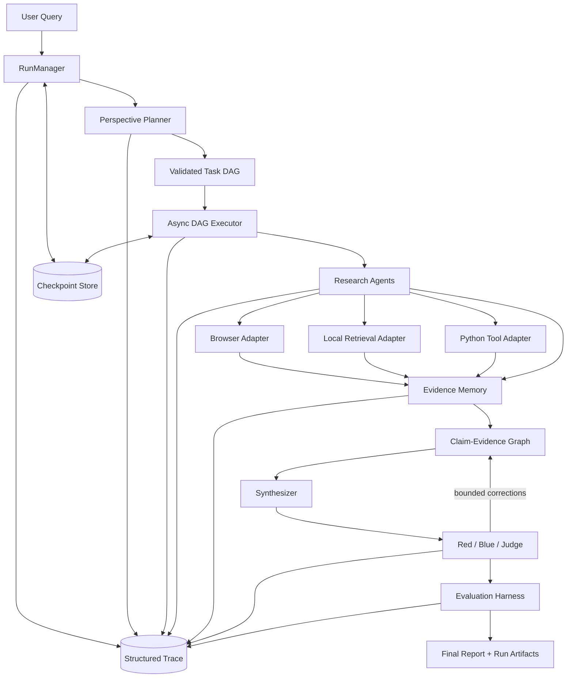

# ResearchOS Agent Architecture

**Status:** Phase 0 logical architecture. Components described below are design
targets unless explicitly marked as implemented.

## System context

ResearchOS Agent separates durable orchestration, research capabilities,
evidence/claim state, verification, and measurement. Domain code depends on
interfaces; integrations depend inward on those interfaces.



The browser, external search, vector store, LLM provider, and trace exporter are
replaceable adapters. They are not part of the domain kernel.

## Component responsibilities

### 1. RunManager

`RunManager` owns the lifecycle boundary for a research run:

- create a run ID and immutable input/configuration snapshot;
- validate operating mode and enabled adapter configuration;
- enforce legal run-status transitions;
- coordinate checkpoint loading, atomic persistence, resume, and finalization;
- expose cancellation and terminal failure semantics;
- maintain aggregate budget state;
- emit a trace event for every lifecycle change.

It does not plan research, execute tools, or judge evidence. Storage is accessed
through a `RunStore` interface. A future filesystem adapter supplies local
durability; tests use an in-memory adapter with equivalent semantics.

Conceptual run states are `CREATED`, `PLANNING`, `READY`, `RUNNING`,
`VERIFYING`, `EVALUATING`, and terminal `COMPLETED`, `PARTIAL`, `FAILED`, or
`CANCELLED`. Phase 1 will formalize the transition table in code and ADR.

### 2. Planner

`PerspectivePlanner` converts a normalized research request into perspectives
and task specifications. A separate DAG builder/validator turns these into a
graph. Validation includes unique task IDs, known dependencies, acyclicity,
capability policy, explicit outputs, and estimated budget constraints.

The planner consumes a model-provider interface rather than a vendor SDK. Its
raw response, parsed result, validation errors, and replan reason are traceable.
Replanning is a bounded runtime command, not an unrestricted recursive call.

### 3. DAG Runtime

`AsyncDAGExecutor` will own scheduling mechanics:

- calculate ready nodes from committed dependency outcomes;
- run tasks within concurrency and resource limits;
- apply per-task retry, backoff, timeout, and idempotency policies;
- isolate independent branch failures and propagate blocked dependencies;
- checkpoint only validated transitions and committed outcomes;
- resume from persisted state without repeating completed side effects;
- request a bounded replan when policy permits;
- reserve and consume budgets atomically;
- emit scheduling, attempt, checkpoint, budget, and failure events.

The runtime does not know provider details. It dispatches typed task requests to
registered agent/tool capabilities. Phase 0 intentionally contains no executor.

### 4. Agent and Tool

An `Agent` interprets a typed research task and chooses permitted tools. A
`Tool` performs one bounded capability with validated input/output. Planned
cross-cutting requirements are:

- stable capability name and schema version;
- explicit mode and adapter identity;
- deadlines, cancellation, and resource policy;
- structured results, artifacts, and errors;
- no direct writes to run state outside runtime-owned interfaces;
- redacted trace events for invocation and completion.

Mocks reproduce contracts, latency/failure controls, and fixtures. They do not
silently replace real adapters.

### 5. Retriever

Retrieval is a domain capability with adapters for local corpora and later
external systems. Requests express query, filters, limit, and provenance needs;
responses contain scored candidates and retrieval metadata. Indexing and
retrieval are separate responsibilities. The architecture does not assume
Milvus or any specific embedding provider.

### 6. Evidence Memory

`EvidenceMemory` stores normalized evidence and exposes deterministic lookup and
deduplication. An evidence record will include source identity, locator,
retrieved time, content/content hash, extraction context, adapter, and schema
version. It must preserve original provenance even when normalized.

The Claim-Evidence Graph stores atomic claims and typed edges such as
`SUPPORTS`, `CONTRADICTS`, and `CONTEXTUALIZES`, including assessment metadata
and revision history. Persistence is behind interfaces so local Phase 5 storage
does not commit the project to a future database.

### 7. Verification

Verification operates on claims and evidence rather than free-form transcripts:

- conflict detection nominates claim/evidence groups for review;
- Red challenges coverage, source quality, and logical support;
- Blue answers challenges using existing or newly authorized evidence;
- Judge records a structured disposition and allowed correction;
- a verification policy caps rounds, time, tokens, cost, and new tool calls.

Unresolved conflict is an output state, not an exception to hide. These roles
are not implemented in Phase 0.

### 8. Evaluation

The evaluation harness consumes immutable run artifacts and versioned fixtures.
It has independent evaluator interfaces for retrieval, trajectory, and report
quality. It records evaluator/configuration versions, inputs, outputs, skipped
reasons, and uncertainty. Ablations must hold datasets and evaluation policy
constant while varying declared system components.

Evaluation must not mutate the run being evaluated. Candidate metrics are
defined in `EVALUATION.md`.

### 9. Observability

The durable source of truth is a local, append-only structured trace. Optional
exporters may mirror events but cannot be the only record. Every event will
carry at least:

- schema version, event ID, event type, timestamp;
- run ID and, when applicable, task/attempt/agent/tool IDs;
- previous and next state for state transitions;
- correlation/causation IDs;
- sanitized attributes, duration, budget delta, and error classification.

Important events include run and task transitions, scheduling decisions,
planner/replan decisions, tool calls, evidence/claim mutations, checkpoint
commits, verification outcomes, budget decisions, evaluation results, and
terminal publication. Secret redaction happens before persistence.

## Primary data flow

1. The request enters `RunManager`; validated inputs and mode are persisted.
2. The planner produces perspectives and a candidate DAG; the validator either
   commits it or returns explicit errors.
3. The executor selects ready nodes, reserves budget, and dispatches typed work.
4. Tools return structured observations and artifacts; evidence ingestion
   normalizes provenance and updates claim links.
5. Checkpoints commit task outcomes and budget state before dependents advance.
6. Synthesis reads the graph and produces a claim-addressable draft.
7. Bounded verification may add tasks/evidence or revise claim dispositions.
8. Evaluation reads frozen artifacts; finalization writes the manifest and
   exposes complete, partial, or failed status.

## Failure and recovery model

- Expected operational failures are typed data, not swallowed exceptions.
- A task attempt may fail without failing independent DAG branches.
- Dependents become blocked only according to declared dependency policy.
- Checkpoints use atomic replace/commit semantics and schema versions.
- Resume validates the input/configuration hash and checkpoint compatibility.
- External side effects require an idempotency key or an explicit non-retryable
  policy.
- Trace export failure is visible but never erases the local durable event.

## Package direction

The planned dependency direction is:

```text
domain contracts <- application services <- interfaces <- adapters/entrypoints
```

The domain layer must not import vendor SDKs or filesystem/network adapters.
Concrete package boundaries will be introduced only as phases require them; the
Phase 0 package deliberately contains only version metadata.
